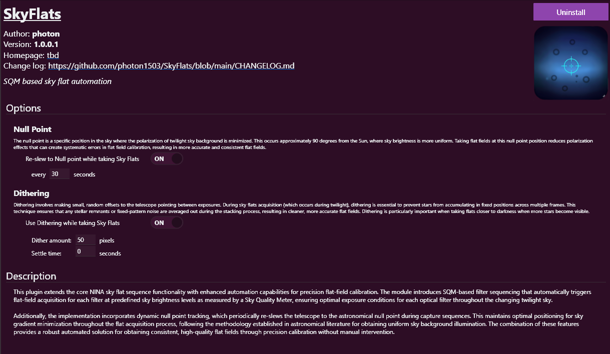

# SkyFlats Plugin for NINA

## Overview

SkyFlats is an advanced plugin for the Nighttime Imaging 'N' Astronomy (NINA) application that enhances sky flat acquisition with intelligent automation and precision calibration capabilities. The plugin uses SQM (Sky Quality Meter) based filter sequencing and dynamic null point tracking to obtain optimal flat fields during twilight conditions.

## Features

SkyFlats implements methodologies established in astronomical literature for obtaining uniform sky background illumination. The combination of null point tracking and SQM-based sequencing provides a robust automated solution for precision calibration without manual intervention.

###  Null Point Tracking
- **Automatic Re-slewing**: Periodically re-slews the telescope to the astronomical null point
- **Polarization Minimization**: Targets the position where twilight sky background polarization is minimized
- **Uniform Sky Brightness**: Ensures more consistent sky brightness for superior flat field calibration
- **Configurable Interval**: Default re-slew every 30 seconds (configurable)

  Note: We are using here the **Zenith-Anti-Solar Point Compromise**, which is near the zenith, offset to the anti-solar horizon.
  The true null point would be 90° apart from the sun, at the same altitude as the sun. 

### SQM-Based Filter Sequencing
- **Automated Triggering**: Automatically initiates flat-field acquisition for each filter at predefined sky brightness levels
- **Optimal Conditions**: Ensures perfect exposure conditions for each optical filter throughout changing twilight conditions
- **Precision Calibration**: Maintains consistent quality across all filters

## Installation

1. Ensure you have NINA 3.2 installed 
2. Download the latest SkyFlats plugin from [Releases Page](https://github.com/photon1503/SkyFlats/releases)
3. Place the plugin file in NINA's Plugins directory
4. Restart NINA 

## Plugin Options

- **Null Point Tracking**: Enable/disable and set re-slew interval
- **Dithering**: Enable/disable, set dither amount and settle time

### Sequence Triggers and Instructions 

SkyFlats uses a powerful trigger-based system to automate the entire flat acquisition process. The sequence is built around Sky Quality Meter (SQM) readings as the primary environmental condition.

#### Slew to null point

A generic instruction to slew the telescope to the null point, where sky brightness is most uniform

#### Master Loop Condition

- **Condition**: `SQM loop while [brighter/darker] than [value] mag/arcsec²`
- **Purpose**: Creates the main container for the flat acquisition sequence
- **Function**: Continuously executes the enclosed instructions as long as the specified sky brightness condition is met
- **Termination**: Automatically stops the sequence when the sky brightness exceeds the threshold, preventing unnecessary operation

#### Wait Instruction

- **Condition**: `Wait until SQM [brighter/darker] than [value] mag/arcsec²`
- **Purpose**: Precision timing for filter-specific flat acquisition
- **Function**: Pauses sequence execution until the exact sky brightness level is reached
- **Application**: Ensures each filter captures flats at its optimal brightness window

#### Flat Acquisition Instructions

- **SQM Range**: `[min] - [max] mag/arcsec²`
  - Defines the precise sky brightness window for capture
- **Exposure Range**: `[min] - [max] seconds`
  - Dynamic exposure adjustment within specified limits
- **Histogram Control**: 
  - `Target mean [percentage]%`
  - `Tolerance [percentage]%`
  - Maintains consistent signal levels across all flats
- **Frame Quantity**: `Amount: [number]`
  - Specifies how many flats to capture per filter
- **Filter**: `Filter [filter names]`
  - Specifies the selected filter
- **Camera Settings**: 
  - `Binning [mode]`
  - `Gain [value]`
  - `Offset [value]`
- **Null point** and **Dither** settings will be taken from the plugin options!
  

## Changelog

See the [CHANGELOG.md](https://github.com/photon1503/SkyFlats/blob/main/CHANGELOG.md) for version history and updates.

## License

This project is licensed under the [MIT License](LICENSE).
